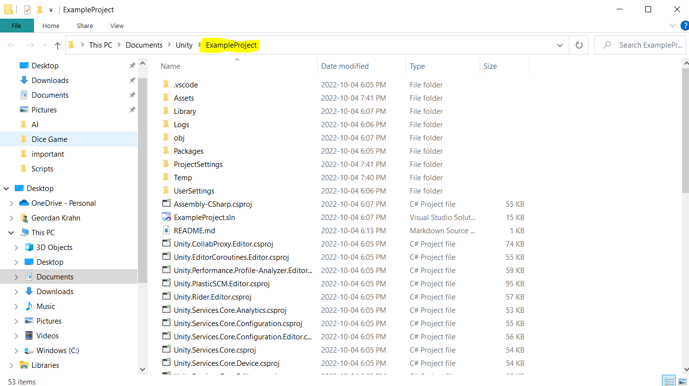

# Unity Project On Github

This guide is intended to show you how to set up your Unity project for version control on Github

## Find your project in File Explorer
- First you will need to open up the project in Explorer
- Right click inside the assets folder and select [Show In Explorer]

- 

- This is where to create a git repository.
- Just make sure this folder is what is tracked for Github
- 

- Make sure to add a .gitignore file.
- You can find one [here](https://github.com/github/gitignore/blob/main/Unity.gitignore)
- 

## publish branch to Github
- Using your preferred application, create a github repository.

- 
- If you have done this correctly, there should be a .git folder in your project folder. This file is hidden, so you will need to change the settings in Explorer to show hidden files to see this folder.
- At this point, you have successfully tracked your project. From another machine, you can now rebuild the repository.

## Clone your repo
- After setting up the github repo, clone it. 
- Alternatively, you may clone this repository to use as an example.
- 

## Open in Unity
- Make sure you remember the location of the cloned project repository
- In the Unity Launcher, open the project from disk, 
- 

- then select the project root
- 

- Thats it. Your project is all set up and ready to go. Unity will automatically regenerate the files ignored in the .gitignore.